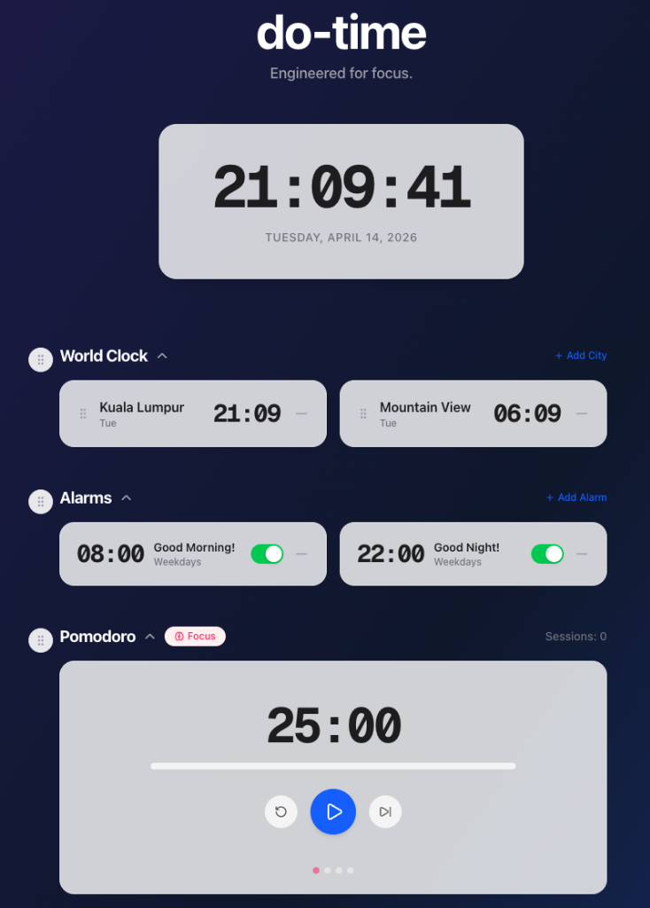
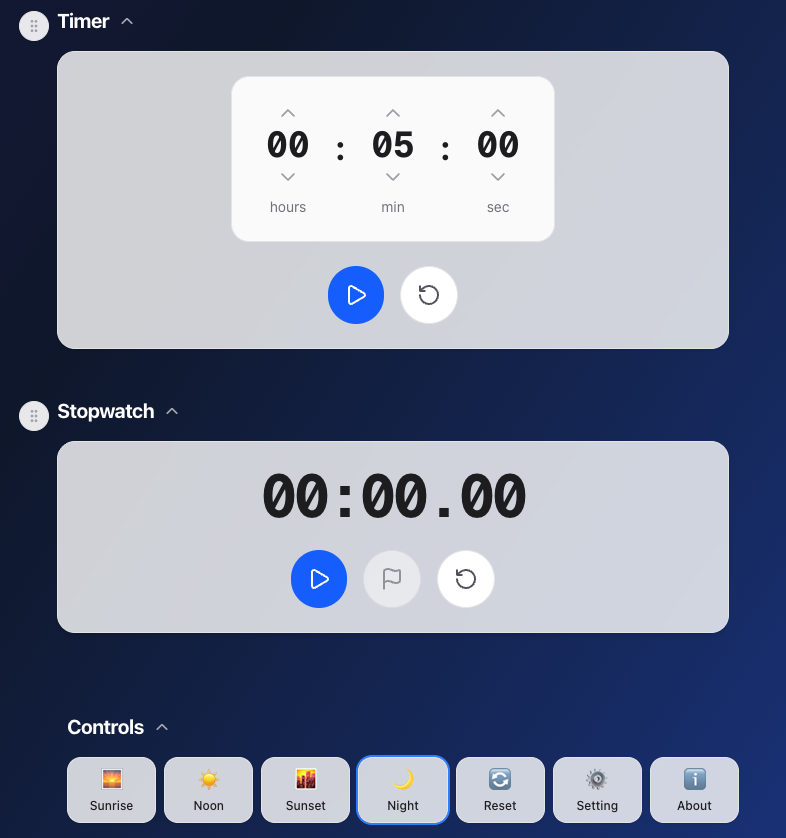
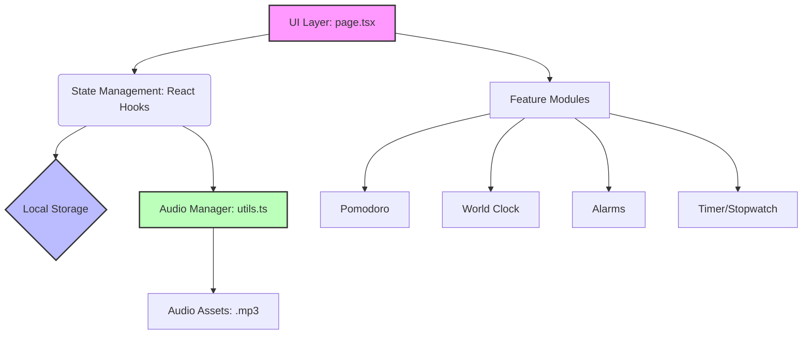

# ⏳ do-time

> **Engineered for Focus.** A premium, minimalist productivity workspace that adapts to your day.

`do-time` is not just another timer app. It is a curated, distraction-free environment designed to help you master your focus and elevate your daily workflow. Inspired by high-end minimalist design and built with cutting-edge web technologies, it transforms time management into a visual experience.

  <a href="https://dotime.priyambodo.com/"><h2>🚀 Live Demo: dotime.priyambodo.com</h2></a>
  
  

---

## 🎯 1. Goal & Objective

In a world full of digital noise, `do-time` aims to be your sanctuary of focus. We believe that productivity tools should be as beautiful as they are functional.

*   **Elevate Deep Work**: By leveraging the proven Pomodoro technique, `do-time` helps you structure your focus sessions and avoid burnout.
*   **Aesthetic Harmony**: The app reflects the natural progression of your day with dynamic themes, creating a seamless transition between work and rest.
*   **Empower the User**: Every element is customizable. You decide how your workspace looks, sounds, and functions.

---

## ✨ 2. Core Features

### 🌅 Dynamic Time-of-Day Themes
Experience a UI that lives and breathes. The background and typography adapt automatically based on the time of day, or you can override it to match your mood:
*   **Sunrise**: Gentle oranges and pinks to start your day.
*   **Noon**: Bright, crisp whites for peak focus hours.
*   **Sunset**: Warm purples and roses to wind down.
*   **Night**: Deep indigo and slate for calm, focused evening sessions.

### 🍅 Masterful Pomodoro
A fully integrated Pomodoro system with visual progress indicators and smooth transitions between Focus and Break modes.

### 🌍 Borderless World Clock
Track time across the globe with ease. Compare your local time with major hubs like Kuala Lumpur and Mountain View instantly. No limits on how many cities you can add!

### 🔔 Smart Alarms & Custom Sounds
Never miss a beat. Set repeatable alarms with custom labels. 
*   **Pre-configured defaults**: "Good Morning!" at 08:00 and "Good Night!" at 22:00.
*   **Sonic Customization**: Choose different chime profiles (Gentle, Digital, Classic, iPhone) for each module.

### 🎛️ Reorderable Workspace
Your workspace, your rules. Drag and drop the modules to prioritize what matters most to you today.

---

## 🛠️ 3. Technical Architecture

`do-time` is built on a robust, modern stack focused on speed, accessibility, and maintainability.

### The Stack
*   **Core**: [Next.js 14](https://nextjs.org/) (React)
*   **Styling**: [Tailwind CSS](https://tailwindcss.com/) with dynamic glassmorphism effects.
*   **Animations**: [Framer Motion](https://www.framer.com/motion/) for physics-based reordering.
*   **UI Primitives**: [Radix UI](https://www.radix-ui.com/) for accessible, unstyled dialogs.

### System Architecture

### Audio Singleton Pattern
To prevent the annoying "overlapping sound" bug common in web apps, `do-time` uses a custom Audio Singleton pattern in `utils.ts`. This ensures only one chime can play at a time and handles resource cleanup gracefully.

---

## 🚀 Getting Started

1.  Clone the repository
2.  Install dependencies: `npm install`
3.  Run the development server: `npm run dev`
4.  Open `http://localhost:3000` in your browser.

---
Made with ❤️ by [Doddi Priyambodo](https://priyambodo.com)
